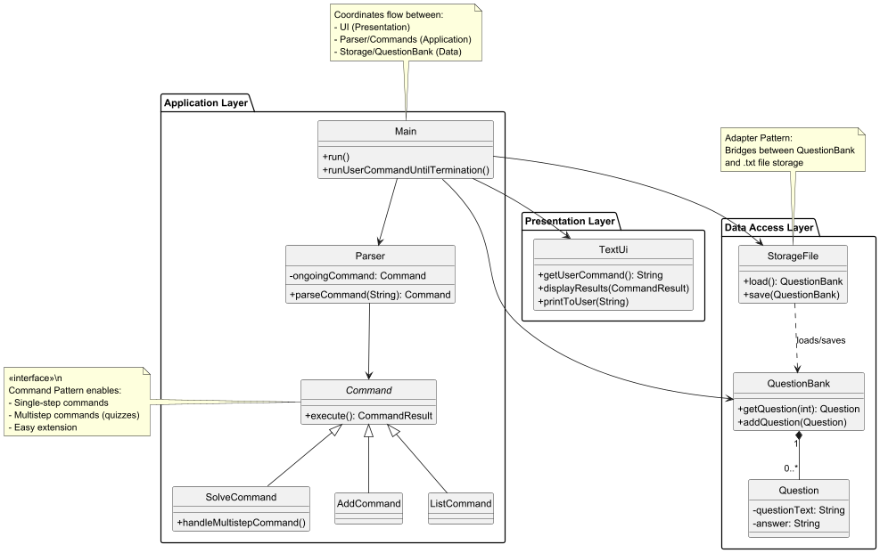
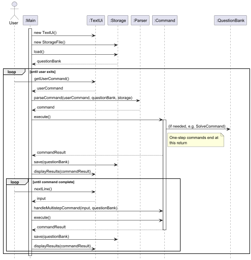
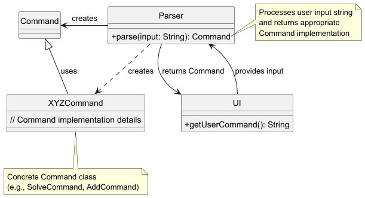
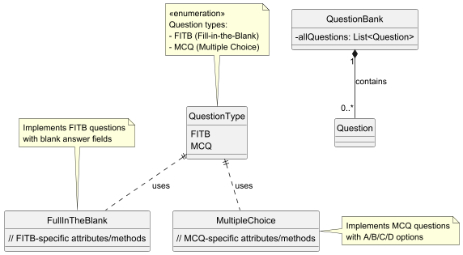
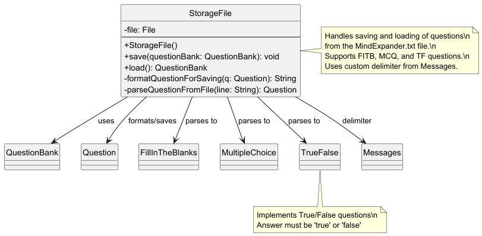
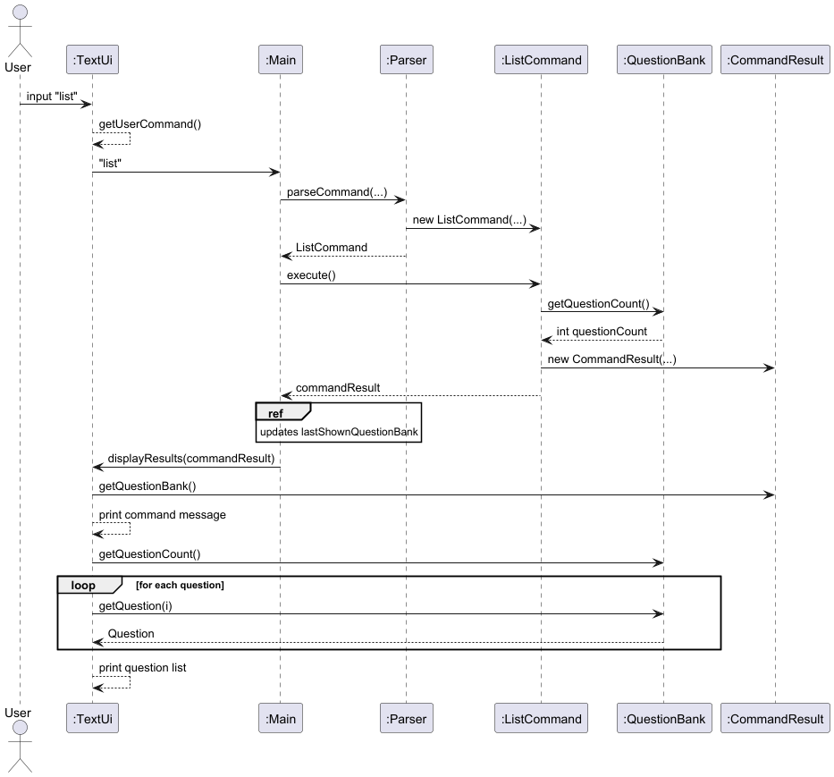
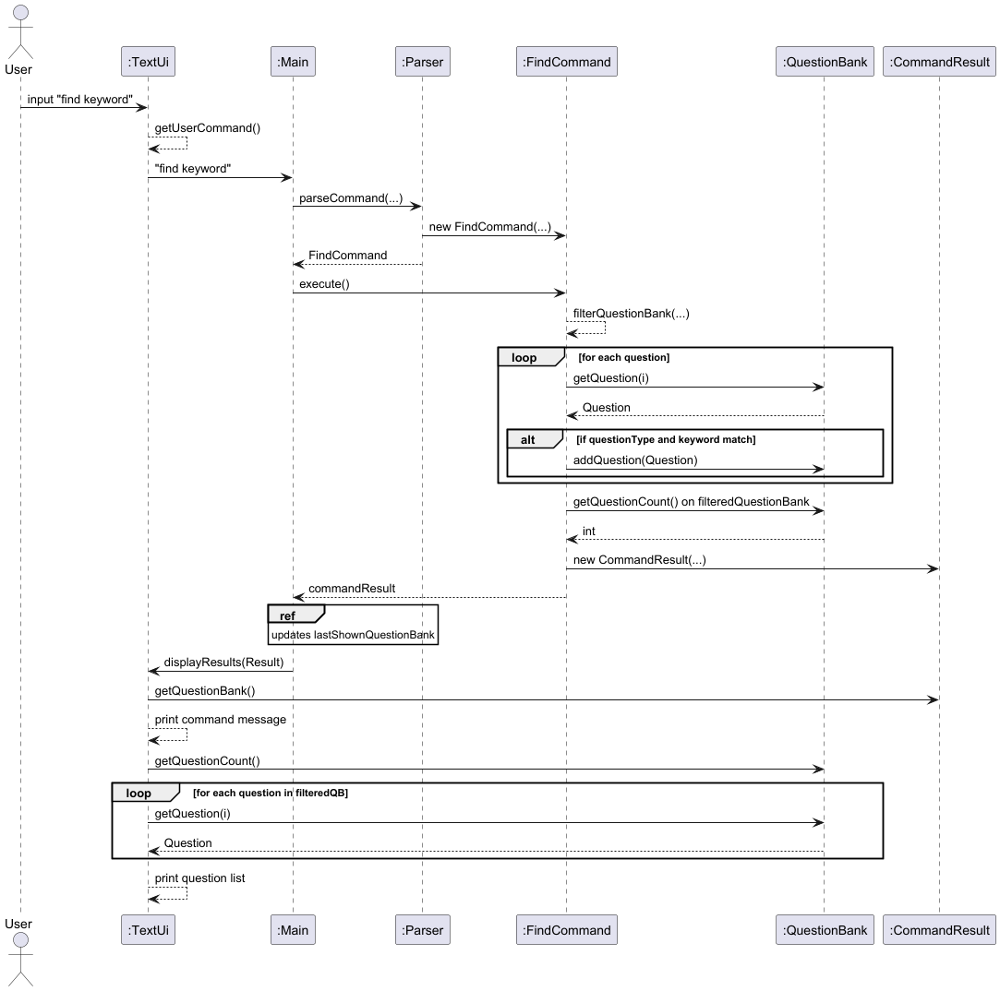
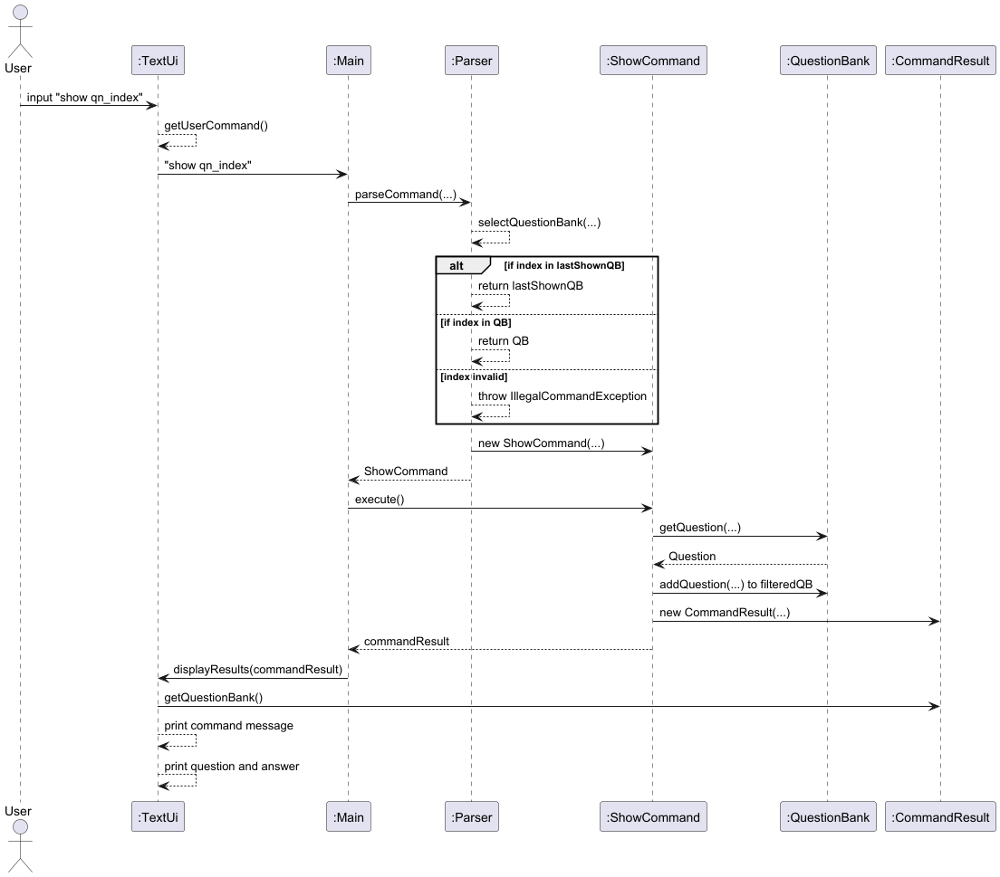

# Developer Guide

## Acknowledgements

MindExpander uses the following tools in the development process:
1. [JUnit 5](https://junit.org/junit5/) - Used for JUnit testing.
2. [Gradle](https://gradle.org/) - Used for build automation.
3. [PlantUML](https://plantuml.com/) - Used for diagram generation in this guide.

## Design & implementation

### Overall design

The project is designed using a hybrid architecture with elements from Command Pattern in the request handling and
Layered Architectures in the organisation of code, roughly categorised into presentation (UI), application (parser, commands) and data access.
This gives developers some flexibility in implementing more complex features such as the multistep commands or even quizzes
in the future while still maintaining some layers for scalability.

The project consists of the following main components:
1. Main: Acts as the interface between the UI, command, data and storage layers.
2. UI: Interface between the user and the program, handling printing to CLI and user input.
3. Parser: Parses the user inputs into commands for the program to execute.
4. Commands: Programme's logic for the respective commands.
5. Exceptions: Custom exception class to handle exception messages for the program.
6. Question: Objects to store data for question details and answers.
7. Question bank: Handle question storing in the list, contains the list of questions.
8. Storage handler: Handles the reading and writing to a .txt file.
9. Common: Stores all magic strings or literals to be printed to user.
10. Command history: Stores up to COMMAND_HISTORY_MAX_SIZE newest commands that can be undone/redone.

The overall relations between the components and classes is as follows:



The overall flow of interaction between the user and program is as follows:



**Note**: Certain elements such as exceptions, enums and logging have been left out for brevity. 
More details on other elements can be found in the segments below.

### User Interface

The MindExpander UI is implemented through the TextUi class, 
which handles user interaction via console-based input and output. 
The Main class orchestrates the application flow, 
ensuring commands are processed and displayed correctly.

The UI component,
- Displays system messages (welcome, errors, results, etc.).

- Receives and validates user input.

- Formats and prints command execution results.

### Command handling

The MindExpander application follows a structured approach to handle user input, 
process commands, and execute actions accordingly. The Parser class is responsible 
for interpreting user input and mapping it to a corresponding Command object, 
which then executes the required action.

The system consists of two primary components:

**Parser**

- Converts raw user input into command objects.

- Manages multi-step commands (e.g., SolveCommand).

- Validates input and throws IllegalCommandException for invalid commands.

**Commands**

- Serves as a base class for all command types.

- Implements execute() method, which performs the command action.

- Handles multistep user interaction when necessary.


  

How the parsing works:
When called upon to parse a user command, the Main class creates a parser which receives user input from ui 
class to parse the user command and create a XYZCommand object (e.g., AddCommand) which the parser returns back 
to main as a Command object.

**Note**
* When adding new single line commands in the future, they should return an instance of the `CommandResult` result class
in the overridden `execute()` method.
  * The only exception to this is the `HelpCommand` class as all it has to do is print the correct help message,
  managed in its constructor.

**Multistep commands**
These are implemented through the use of a finite state machine (FSM), where the different states are defined in a command's
`handleMultistepCommand()` method. The purpose of these multistep commands is to make the processes of some features more
user-friendly. For example, having to complete `add` in a one-step command would make it very hard to add longer questions,
especially MCQ questions with longer options, and reduce the quality of life for users.
The components of the program work together in the following manner:

1. `Main`: Focuses on the loop. 
    1. Orchestrates the command loop, continues looping until the command's `isCommandComplete` flag is set.
2. `Parser`: Command creation and management
   1. If no command is ongoing, parse the new command based on the user's input.
   2. Else, manage the ongoing command by forwarding the new user input to it.
3. `Command`: Handles the command logic. 
   1. The individual commands manage their own FSM logic, handling the transition from one state to the next and when to exit the state machine.
   2. Manages the program logic of the command itself, updating the program output.

**Note**
* The FSM logic is transparent to Main and Parser, as such new steps or states can be added to multistep commands without changing
Parser or main.
* The different states are defined in an enum inside the multistep command's class.
* Multistep commands **should only override** `handleMultistepCommand()` from the `Command` class and **not the** `execute()` method.
The command's messages for the user can be updated using `updateCommandMessage()` within `handleMultistepCommand` instead of returning a `CommandResult`.
The returning of a `CommandResult` instance will be handled automatically by the parent `Command` class.

The class diagram for the example multistep command `SolveCommand`:


**Traceable commands**

The Traceable interface defines a set of behaviour for commands that support undo and redo functionality. 
These commands are considered traceable because their effects can be reversed and reapplied, enabling users to seamlessly 
backtrack or reapply previous actions. Traceable commands integrate with the `CommandHistory` class, which maintains a bounded 
stack of the most recent traceable commands. When a traceable command is successfully executed, it is recorded in the `CommandHistory`.
This enables a reliable and intuitive command reversal mechanism.


**Note**

- Any command that implements Traceable must define:

  - `undo()` – Reverts the action performed by the command.

  - `redo()` – Reapplies the action as if it had just been executed.

  - `undoMessage()`– Returns a user-facing message describing the undo operation.

  - `redoMessage()` – Returns a user-facing message describing the redo operation.

- By default, the CommandHistory class can store up to 10 traceable commands.
  This limit is defined by the constant `COMMAND_HISTORY_MAX_SIZE` in the `CommandHistory` 
  class and can be modified if needed to support a different history depth.
- Undo and redo behaviour is invoked by the user by instantiating UndoCommand and RedoCommand.


### Data

The QuestionBank component 
- is responsible for managing the storage and retrieval of data (all `Question` objects) within the MindExpander application,
- does not depend on any of the other three components (as the `QuestionBank` and `Question` represent data entities of the domain, they should make 
sense on their own without depending on other components)

The system maintains two instances of QuestionBank to efficiently manage questions and enhance user experience when retrieving and modifying data. These two instances are:

- Main `questionBank` – Stores all questions logged into the system.

- `lastShownQuestionBank` – Stores a filtered subset of questions, updated when the user invokes specific commands (e.g., list or find).

This dual-QuestionBank approach improves usability by allowing users to interact with a focused subset of questions before modifying the main dataset.

**QuestionBank Management and Modification Workflow**

- Program Initialisation

  - When the user first launches MindExpander, `StorageFile` loads saved questions into `questionBank`.
  - `lastShownQuestionBank` is initially set to `questionBank`.

- Command Execution and `lastShownQuestionBank` Updates

  - When the user executes the `list` command, `lastShownQuestionBank` is updated to contain all questions from the main `QuestionBank`.

  - When the user executes the `find` command, `lastShownQuestionBank` is updated to contain only the questions matching the search criteria.

- Referencing `lastShownQuestionBank` for Modifications

    - If a user attempts to modify (e.g., `edit`, `delete`) a question, the system first references `lastShownQuestionBank`.

  - This ensures that users can modify questions based on their last viewed subset without needing to manually find their index in the full question bank.

- Synchronizing Changes with the Main `QuestionBank`

    - Once a modification is applied (e.g., a deletion or an edit), the `Command` class updates the main `QuestionBank` accordingly.

  - This maintains data consistency and ensures that all logged questions remain up to date.
  
### Storage

The `StorageFile` class is responsible for saving and loading questions to/from a local text file `./data/MindExpander.txt`, ensuring data persistence across user sessions.

This class handles serialisation and deserialisation of all supported question types:
- ✅ Fill-in-the-Blanks (FITB)
- ✅ Multiple Choice Questions (MCQ)
- ✅ True/False (TF)

#### **Class Diagram**
The following class diagram shows the key dependencies and responsibilities of the StorageFile class:


#### **File Format**

* Each line in the file represents a single question, with components separated by a custom delimiter defined in `Messages.STORAGE_DELIMITER`.  

* This custom delimiter `%%MINDEXPANDER_DELIM%%` is used instead of the standard pipe `|` to prevent parsing errors if users include 
special characters like `|` in their input.
* The general format is:

    * `FITB<DELIM>QuestionText<DELIM>Answer`
    * `MCQ<DELIM>QuestionText<DELIM>Option1<DELIM>Option2<DELIM>Option3<DELIM>Option4`
    * `TF%%MINDEXPANDER_DELIM%%QuestionText%%MINDEXPANDER_DELIM%%Answer`

* Example: 
    * `FITB%%MINDEXPANDER_DELIM%%What is the capital of France?%%MINDEXPANDER_DELIM%%Paris`
    * `MCQ%%MINDEXPANDER_DELIM%%2 + 3 = ?%%MINDEXPANDER_DELIM%%5%%MINDEXPANDER_DELIM%%1%%MINDEXPANDER_DELIM%%2%%MINDEXPANDER_DELIM%%3`
    * `TF%%MINDEXPANDER_DELIM%%The sun rises in the east.%%MINDEXPANDER_DELIM%%true`
#### **Saving Logic**

* The method `save(QuestionBank questionBank)` writes all current questions in the question bank to a text file located at `./data/MindExpander.txt`.
* If the `data/` directory does not exist, it is created.
* Questions are serialised using `formatQuestionForSaving(Question q)`, which:
  * Checks the question type (FITB, MCQ, TF)
  * Converts it into a string based on the appropriate format.

#### **Loading Logic**

* The method `load()` reads the `MindExpander.txt` file line-by-line and reconstructs each question.

* For MCQ:
    * The first option is always considered the correct answer.
    * The remaining 3 options are treated as distractors.
* For TF questions:
  * The answer must be "true" or "false" (case-insensitive).
  * If any line is malformed or unsupported, it is ignored.

#### **Design Rationale for Custom Delimiter**

* Early versions of StorageFile used the pipe symbol `|`, which caused issues when users typed it as part of their question or answer.
* To prevent data corruption, we replaced it with a unique string unlikely to appear naturally:
  `%%MINDEXPANDER_DELIM%%`
* This string is defined once in `Messages.java` to eliminate magic strings and ensure consistency across the codebase.

#### **Input Validation for Reserved Delimiters**
* To prevent users from accidentally corrupting the saved question file, all inputs are now validated to reject any content 
containing the reserved storage delimiter `%%MINDEXPANDER_DELIM%%`.
    * The validation logic is implemented in the `InputValidator` class (under the `common` package).
    * It is triggered whenever user input is taken via multistep commands (e.g., `AddCommand`, `EditCommand`).
    * If the reserved delimiter is detected, the validator throws an `IllegalCommandException`.
* Each command is responsible for handling this exception and giving context-specific feedback to the user.


### Listing questions

The `list` command displays all the questions currently in the question bank, and at the same time updates lastShownQuestionBank whenever it is executed.

The `list answer` command displays all the questions currently in the question bank, along with their answers. It also updates lastShownQuestionBank whenever it is executed.

For both `list` and `list answer`, they make use of CommandResult, which stores both the message from the command, as well as the questionBank.

The sequence diagram when calling `list`:


### Finding questions containing a keyword

The `find` command allows users to find all questions in the questionBank that containing a keyword. Similar to `list`, `find` also updates lastShownQuestionBank whenever it is executed.

The default behaviour for `find` returns a list of all question types containing the specified keyword. To filter the search even clearer, `find mcq` and `find fitb` can be used to search for MCQ or FITB questions (respectively) containing the keyword.

The sequence diagram when calling `find`:


### Showing the answer to a specific question

The `show` command allows users to view the answer to a question by querying its question index. However, the question and answer that is displayed __does not__ update the lastShownQuestionBank like `list` and `find` do. 

`show` also prioritises searching through the last shown list, before searching through the question bank, and finally it returns an error if it still cannot find a question with that specific question index.

`show` takes in one argument, the `[QUESTION_INDEX]`, based on the last shown list that the user sees.

The sequence diagram when calling `show`:


#### **Integration with Main**
* Every time a command modifies the QuestionBank (e.g., add, delete, edit), the updated data is automatically saved.
* This logic is handled in the Main class and is transparent to the user — no manual saving is needed.

### Logging features

MindExpander keeps track of several things to either help with product development in the future (e.g. error logging) or
provide benefit to users (e.g. previously entered commands, questions that have been added and their attempts at solving questions).

The logger classes inherit from a parent `BaseLogger` class and contain static methods so they can be called easily
in the program's features, for example the `SolveCommand` class can use `SolveAttemptLogger` log methods without needing to
manage an instance of it.

The log files are stored in a logs folder. This process is managed by a `LogsManager` which handles the checking of the
folder's existence and its creation for all logger classes.

#### **Solve Attempt Logs**
Logs users' attempts at solving questions, storing the date and time of the attempt, the question attempted and the
result of the attempt (either CORRECT or WRONG). This log serves to keep track of a user's performance over time. It can
be examined to find specific questions which users struggle with a lot and constantly get wrong.

The attempts are stored in a file named `solveAttemptLogs.txt`
in the following format: `Timestamp|Question|Result`

For example:
```
2025-04-04 19:40:40|FITB: hey|CORRECT
2025-04-04 19:40:46|FITB: hey|WRONG
2025-04-04 19:40:56|MCQ: hello\nA. hi\nB. hiii\nC. hiv\nD. hii\n|CORRECT
2025-04-04 19:41:01|MCQ: hello\nA. hiii\nB. hi\nC. hiv\nD. hii\n|WRONG
```

### **Error Logs**
Logs users' errors whenever they type in an invalid input, storing the date and time of the attempt, the user's input, as well as the error message. This log can be used to inform users on what types of inputs are invalid and erroneous.

The errors are stored in a file name `errorLogs.txt` in the following format: `Timestamp|Input|Error`

For example:
```
2025-04-06 12:23:42|find|Invalid command! Please enter either `find [KEYWORD]`, `find mcq [KEYWORD]`, `find fitb [KEYWORD]` or `find tf [KEYWORD]`.
2025-04-06 12:35:55|list 2|Invalid command! Please enter either `list`, `list [mcq/fitb/tf]`, `list [mcq/fitb/tf] answer` to view the question bank
2025-04-06 12:37:08|list answer 3 3|You have entered an unknown command. Please refer to the user guide, or type <help> to display the available commands
```
### **Question Logs**
Tracks all meaningful question-related changes — specifically adding, editing, and deleting questions. This log helps users or developers review how questions have evolved over time.

The questions are stored in a file name `questionLogs.txt` in the following format: `Timestamp|Action|QuestionType|FullQuestion`

For example:
```
2025-04-06 20:11:15|ADDED|FITB|FITB: The capital of Italy is ___ [Answer: Rome]  
2025-04-06 20:12:10|DELETED|TF|TF: Water boils at 100°C [Answer: true]  
2025-04-06 20:13:45|EDITTED|MCQ|MCQ: Who developed the theory of relativity? [Answer: Albert Einstein]  
```

#### **Note**
The question log only tracks the core content of questions - namely the question text and answer. Changes to multiple choice options are not logged, to avoid clutter and focus on meaningful content changes.

## Product scope
### Target user profile

The product is designed for younger students. 
Their level of education is at the point where examination questions come in simpler forms such as fill in the blanks or multiple choice questions.

### Value proposition

This product aims to solve the problem of students not having a convenient place to store questions they would like to practice or refer to again in the future.

## User Stories

| Version | As a ...         | I want to ...                                                                                 | So that I can ...                                                          |
|---------|------------------|-----------------------------------------------------------------------------------------------|----------------------------------------------------------------------------|
| v1.0    | new user         | view a list of commands and their uses                                                        | refer to them to understand how to use the program                         |
| v1.0    | user             | add questions into the question bank                                                          | store it for future practice                                               |
| v1.0    | user             | list the questions I have previously added in the question bank                               | check what questions I have added previously                               |
| v1.0    | user             | list the questions I have previously added in the question bank with their respective answers | check what questions I have added previously along with their answers      |
| v1.0    | user             | save my questions permanently                                                                 | the questions that i have added will not be lost                           |
| v1.0    | user             | load my saved questions when i start the program                                              | see and work on the questions even after closing and reopening the program |
| v1.0    | user             | have my answer inputs evaluated                                                               | practice the questions previously added                                    |
| v2.0    | user             | find a question in the question bank by name                                                  | locate whether I have previously added a similar question                  |
| v2.0    | experienced user | solve questions by typing everything in one command                                           | answer questions faster without going through the multiple steps           |
| v2.0    | user             | edit the questions that are currently in my question bank                                     | update outdated or incorrect question details                              |
| v2.0    | user             | delete a question from the question bank                                                      | remove outdated or incorrect questions                                     |
| v2.1    | user             | show the answer of a question from the question bank                                          | check the answer for that specific question                                |
| v2.1    | user             | undo and redo my command                                                                      | easily correct mistakes and experiment without losing progress.            |


## Non-Functional Requirements

* Should work on any _mainstream_ OS as long as it has Java `17` or above installed.
* Should support future question types without major architectural changes.
* Text output should be readable in standard terminals (no reliance on special colours or fonts e.g. Nerd fonts)
* Programs should train users' understanding and memory of concepts (default list command should not give away answers,
MCQ should not be the same options tagged to the same answers each time, etc.).
* Error messages should be clear and actionable (e.g. Please enter a valid ___).
* Number of questions added should not be limited by the program.
* Commands should not be overly complicated to use, for example having to type too many items in one long single line
command. This can be solved by breaking down the command in a user-friendly manner with multistep commands.

## Glossary

* *Multistep command* - A feature which requires the user to go through several steps to complete.
* *FITB* - Fill in the Blanks question type, where the answer is a string entered by the user.
* *MCQ* - Multiple Choice Question question type, where the answer is one of the options A, B, C or D.
* *TF* - True/False question type, where the answer is a boolean true or false.
* *FSM* - Finite State Machine, used in multistep command handling.
* *CLI* - Command Line Interface.
* *Command Pattern* - A behavioral design pattern that encapsulates requests as objects, allowing parameterization and 
queuing of operations. The design pattern used for command handling.
* *Layered Architecture* - A software design approach that organizes components into hierarchical layers, where each
layer has a specific responsibility and interacts only with adjacent layers. The architectural style used in the design.

## Instructions for manual testing

### Launch and Shutdown
1. Initial launch
   1. Download the jar file.
   2. Copy the file to the folder you want to use as the _home_ folder.
   3. Open a command terminal, and `cd` into the folder you put the jar file in.
   4. Run `java -jar MindExpander.jar` to run MindExpander.
   5. The following screen should be displayed:
   ```
   ==============================
    
       _____  .__            .______________                                .___            
      /     \ |__| ____    __| _/\_   _____/__  ______________    ____    __| _/___________
     /  \ /  \|  |/    \  / __ |  |    __)_\  \/  /\____ \__  \  /    \  / __ |/ __ \_  __ \
    /    Y    \  |   |  \/ /_/ |  |        \>    < |  |_> > __ \|   |  \/ /_/ \  ___/|  | \/
    \____|__  /__|___|  /\____ | /_______  /__/\_ \|   __(____  /___|  /\____ |\___  >__|   
            \/        \/      \/         \/      \/|__|       \/     \/      \/    \/
    
    Presented by: CS2113-F12-3
    Welcome to MindExpander!
    ==============================
    ==============================
    What would you like to do today?
    Type <help> for a list of commands.
    ==============================
   ```
2. Exiting MindExpander
   1. Test case: `exit`
    
       Expected: The program exits and returns user to the command terminal.
   
### Adding a question
1. Add is a _multistep command_, below is the procedure for the test case to add a question
   1. Enter `add`
   2. Enter `mcq` or `fitb` or `tf` as the question type
   3. Enter `1 + 1` as the question.
   4. 
      1. For `fitb` and `mcq` Enter `2` as the answer.
      2. For `mcq`, enter 3 other incorrect options: `1`, `3`, `4`.
      3. For `tf`, enter `true` as the answer
   
### Listing all questions
1. List all the questions currently in the question bank.
   1. Test case: `list`
   
        Expected: The list of questions in the question bank will be displayed.
   2. Test case: `list answer`

        Expected: The list of questions with their corresponding answers in the question bank will be displayed.
   3. Test case: `list mcq`

        Expected: The list of MCQ questions in the question bank will be displayed.
   4. Test case: `list mcq answer`
      
        Expected: The list of MCQ questions with their corresponding answers in the question bank will be displayed.
   5. Test case: `list fitb`

        Expected: The list of FITB questions in the question bank will be displayed.
   6. Test case: `list fitb answer`

        Expected: The list of FITB questions with their corresponding answers in the question bank will be displayed.
   7. Test case: `list tf`

        Expected: The list of TF questions in the question bank will be displayed.
   8. Test case: `list tf answer`

      Expected: The list of TF questions with their corresponding answers in the question bank will be displayed.

### Finding questions containing a keyword
1. Finding all questions that contain a specific keyword.
   1. Prerequisites: There are already questions contained in the question bank.
   2. Test Case: `find MRT`
   
      Expected: Displays all questions (`mcq`, `fitb` and `fitb`) that contain `MRT` in the question. If there are no such questions with the `MRT` keyword, UI will print `No questions with MRT found!`.
   3. Test Case: `find mcq MRT`
    
      Expected: Displays all `mcq` questions that contain `MRT` in the question. If there are no such questions with the `MRT` keyword, UI will print `No questions with MRT found!`.
    
   4. Test Case: `find fitb MRT`
    
      Expected: Displays all `fitb` questions that contain `MRT` in the question. If there are no such questions with the `MRT` keyword, UI will print `No questions with MRT found!`.
   5. Test Case: `find tf MRT`

      Expected: Displays all `tf` questions that contain `MRT` in the question. If there are no such questions with the `MRT` keyword, UI will print `No questions with MRT found!`.

### Showing the answer to a specific question
1. Showing the answer to a specific question based on its index.
   1. Prerequisites: There are already questions contained in the question bank.
   2. Test Case: `show 1`

        Expected: Shows the question and answer to question 1.

### Deleting a question
1. Allows the user to remove a question from the question bank based on its index from the last shown list.

   1. Prerequisite: You must run `list` or `find` to get an updated list and know the index.
2. Test Case: Deleting a question after `list`
     1. Command: `list`
        * Expected: Displays all questions in the question bank with their respective indexes starting from 1.
     2. Command: delete 1
        * Expected: Deletes the question at index 1 of the full list.
    3. UI prints: `Deleted question: FITB: What is 2 + 2? [Answer: 4]`
3. Test Case: Deleting a question after `find`
     1. Command: `find mcq fries`
        * Expected: Displays only MCQ questions that contain the keyword "fries" with updated index numbers (starting from 1).
     2. Command: delete 1
        * Expected: Deletes the first question in the filtered results (not the global index from full list).
   3. UI prints: `Deleted question: MCQ: What are fries made of? [Answer: Potato]`


4. Invalid Index Case: `delete 100` (when the list has fewer than 100 questions)
   Expected: `Invalid question index.`


## Future Enhancements

### Test paper generation
*Description*
Generate a test paper with a randomly selected list of questions.

*Tentative implementation plans*
* Create a new `QuestionBank` instance called `testQuestions`, which will have questions previously added to the main
`questionBank` chosen randomly and added in, based on how many the user wants.
* Number of questions that can be added in <= total number of questions in `questionBank`.
* The test question bank can be generated with a `CreateTestBankCommand`.
* The test can be started with a `StartTestCommand` and ended with an `EndTestCommand`.
* Commands such as `find` and `solve` will use this new test question bank instead during the test duration while commands
like `add` and `edit` will be disabled.
