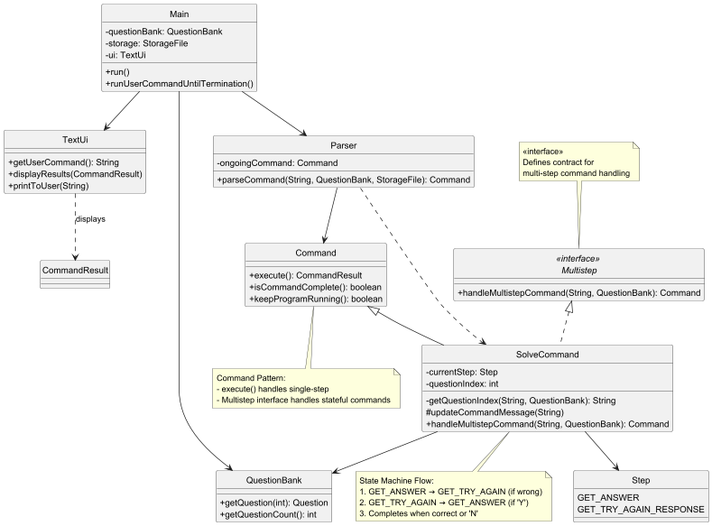

# Developer Guide

## Acknowledgements

MindExpander uses the following tools for development:
1. [JUnit 5](https://junit.org/junit5/) - Used for JUnit testing.
2. [Gradle](https://gradle.org/) - Used for build automation.

## Design & implementation

### Overall design

The project is designed using a hybrid architecture with elements from Command Pattern in the request handling and
Layered Architectures in the organisation of code into presentation (UI), application (parser, commands) and data access.
This gives developers some flexibility in implementing more complex features such as the multistep commands or even quizzes
in the future while still maintaining some layers for scalability.

The project consists of the following main components:
1. Main: Acts as the interface between the UI, command, data and storage layers.
2. UI: Interface between the user and the program, handling printing to CLI and user input.
3. Parser: Parses the user inputs into commands for the program to execute.
4. Commands: Programme's logic for the respective commands.
5. Exceptions: Custom exception class to handle exception messages for the program.
6. Question: Objects to store data for question details and answers.
7. Question bank: Handle question storing in the list, contains the list of questions.
8. Storage handler: Handles the reading and writing to a .txt file.

The overall relations between the components and classes is as follows:

{Insert class diagram here}

The overall flow of interaction between the user and program is as follows:

{Insert sequence diagram here}

### User Interface

{Describe how the UI works}

### Command handling

{Describe how the parser, commands and multistep commands work}

**Parser**

**Commands**

**Multistep commands**
These are implemented through the use of a finite state machine (FSM), where the different states are defined in a command's
`handleMultistepCommand()` method. The components of the program work together in the following manner:

1. `Main`: Focuses on the loop. 
    1. Orchestrates the command loop, continues looping until the command's `isCommandComplete` flag is set.
2. `Parser`: Command creation and management
   1. If no command is ongoing, parse the new command based on the user's input.
   2. Else, manage the ongoing command by forwarding the new user input to it.
3. `Command`: Handles the command logic. 
   1. The individual commands manage their own FSM logic, handling the transition from one state to the next and when to exit the state machine.
   2. Manages the program logic of the command itself, updating the program output.

**Note**
* The FSM logic is transparent to Main and Parser, as such new steps or states can be added to multistep commands without changing
Parser or main.
* The different states are defined in an enum inside the multistep command's class.
* Multistep commands should only override `handleMultistepCommand()` from the `Command` class and not the `execute()` method.
The command's messages for the user can be updated using `updateCommandMessage()` within `handleMultistepCommand` instead of returning a `CommandResult`.
The returning of a `CommandResult` instance will be handled automatically by the parent `Command` class.

The class diagram for the example multistep command `SolveCommand`:

### Data

{Describe the questions and question bank}

### Storage

{Describe the storage mechanism}

## Product scope
### Target user profile

The product is designed for younger students. 
Their level of education is at the point where examination questions come in simpler forms such as fill in the blanks or multiple choice questions.

### Value proposition

This product aims to solve the problem of students not having a convenient place to store questions they would like to practice or refer to again in the future.

## User Stories

|Version| As a ...         | I want to ...                                                                                 | So that I can ...                                                     |
|--------|------------------|-----------------------------------------------------------------------------------------------|-----------------------------------------------------------------------|
|v1.0| new user         | view a list of commands and their uses                                                        | refer to them to understand how to use the program                    |
|v1.0| user             | <todo> story for add                                                                          |                                                                       |
|v1.0| user             | list the questions I have previously added in the question bank                               | check what questions I have added previously                          |
|v1.0| user             | list the questions I have previously added in the question bank with their respective answers | check what questions I have added previously along with their answers |
|v1.0| user             | <todo> story for store                                                                        |                                                                       |
|v1.0| user             | have my answer inputs evaluated                                                               | practice the questions previously added                               |
|v2.0| user             | find a question in the question bank by name                                                  | locate whether I have previously added a similar question             |
|v2.0| experienced user | solve questions by typing everything in one command                                           | answer questions faster without going through the multiple steps      |
|v2.0| user             | <todo> story for edit                                                                         |                                                                       |
|v2.0| user             | <todo> story for delete                                                                       |                                                                |

## Non-Functional Requirements

{Give non-functional requirements}

## Glossary

* *Multistep command* - A feature which requires the user to go through several steps to complete.

## Instructions for manual testing

{Give instructions on how to do a manual product testing e.g., how to load sample data to be used for testing}
